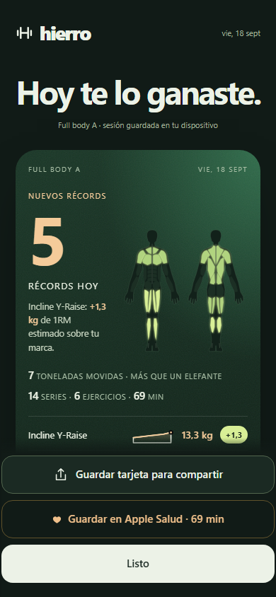
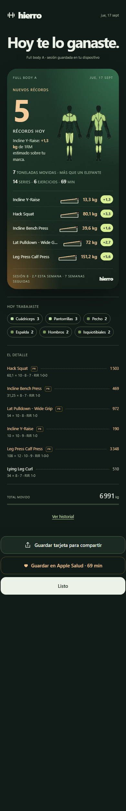
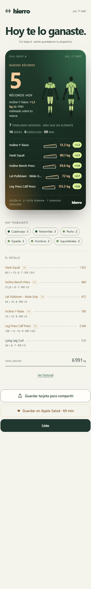
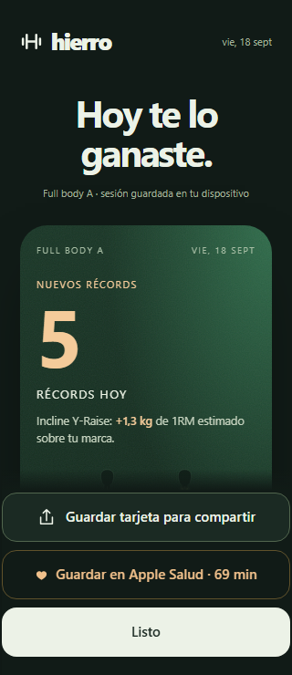
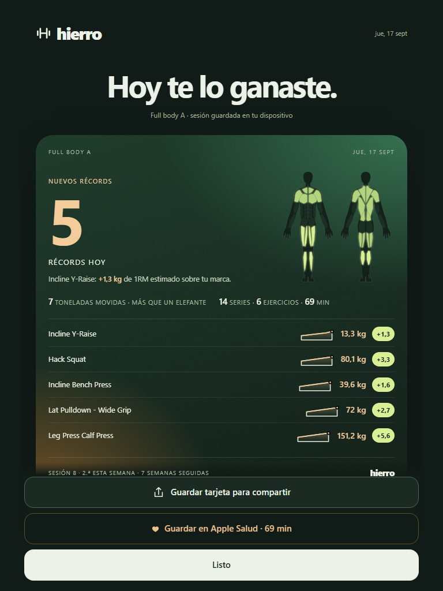

# Hierro Beta 3.8.0 · el póster del día

La pantalla que aparece al terminar una sesión conservaba una tarjeta con un número de 1RM estimado, una curva y un listado. Era correcta y no transmitía nada: el 1RM de un ejercicio accesorio es un número pequeño, la curva era genérica y no había ninguna imagen del esfuerzo. Esta versión la sustituye por un póster pensado para guardar la captura.

## Decisiones

1. **Un número que signifique algo.** Con dos o más marcas, el número gigante es cuántas fueron. Con una sola, es su valor. Sin marcas, es el peso movido en toneladas a partir de 1 000 kg, en kilos por debajo y en libras cuando la app se usa en libras. En descarga, las semanas seguidas. Debajo, una frase corta con el contexto: la mejora mayor sobre su marca anterior, la comparación con la última sesión completa del mismo plan, o el motivo de la descarga.
2. **El cuerpo como imagen.** Las dos siluetas de Evolución, en el póster, con solo los grupos de hoy y un brillo lima. La rampa sigue siendo de un solo color por cantidad de series. Sin grupos asignados no se dibuja nada; el número ocupa todo el ancho.
3. **Escala para el peso movido.** Una equivalencia aproximada y redondeada (una moto, un coche, un elefante, un autobús) acompaña a las toneladas. Es figurativa y se presenta como tal; los kilos exactos siguen en el recibo.
4. **Todas las marcas dentro del póster.** Cada fila lleva nombre, una curva corta de sus últimas sesiones, el valor nuevo y cuánto subió. Hasta cinco filas; el resto queda marcado en el detalle. Sin marcas, la fila muestra la serie más pesada del día.
5. **La constancia al pie, junto a la firma.** Número de sesión, cuántas van esta semana y cuántas semanas seguidas, contadas hasta esa fecha para que el diario muestre lo mismo que el cierre. Solo se anuncia lo que es noticia.
6. **Siempre oscuro.** El póster tiene su propia paleta, verde profundo con lima y ámbar, en ambos temas: la captura es la misma y el brillo de las siluetas funciona. El resto de la pantalla sigue el tema activo.
7. **El titular es siempre la mejora mayor.** Al reabrir desde el diario las marcas llegan sin porcentaje y en el orden del plan; la pantalla las ordena por mejora relativa.
8. **Por debajo de 360 px** las siluetas pasan bajo el número y las curvas cortas se ocultan para que las filas quepan.
9. **3.8.1: la barra de acciones queda por encima del póster.** El póster aísla su propio contexto de apilamiento y la barra fija declara prioridad, así que las siluetas, las curvas y los textos ya no se dibujan sobre los botones al desplazar. Las capturas de 390 y 320 px se tomaron de nuevo con esta corrección.

## Verificación

Las capturas usan datos ficticios sembrados en un origen local independiente, con la app servida desde el repositorio y abierta mediante `uiReturnToFinish` sobre la sesión sembrada, en perfiles de navegador nuevos para cada captura. No se tocaron los datos de la cuenta.

- 390 × 844, página completa en oscuro y claro, 320 × 740 y 768 × 1024. El número, la palabra, las siluetas y las cifras no se solapan; los nombres largos se recortan con puntos suspensivos dentro de su fila.
- `tests/run.js` incluye la suite «3.8.0 — el póster del día»: número gigante y orden de marcas, toneladas con equivalencia y cifras, siluetas encendidas con su lista de grupos, constancia al pie, curva y diferencia por marca, desaparición de la tarjeta antigua, mismo orden al reabrir, peso movido con escala cuando no hay marcas, ausencia de siluetas sin grupos, y las funciones `volumeLike` y `tonnageParts` sobre kilos reales.
- Las pruebas anteriores de cierre se conservan con dos expectativas actualizadas al nuevo titular. Descarga, sesión parcial, peso corporal, Apple Salud y recibo no cambian.

