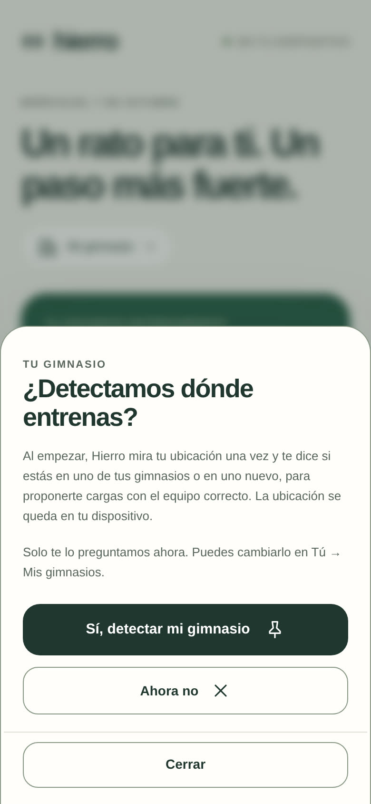
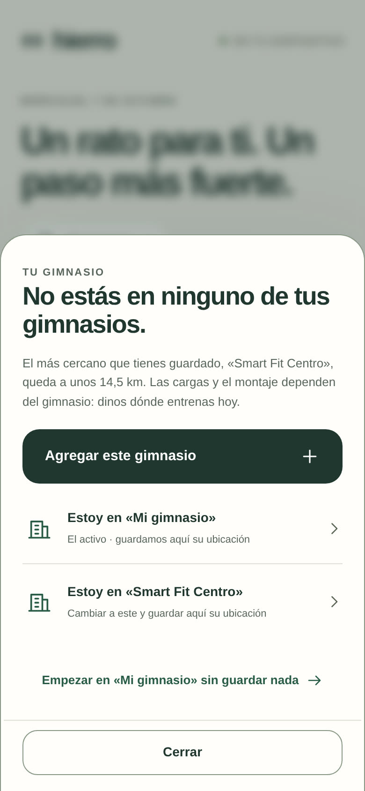
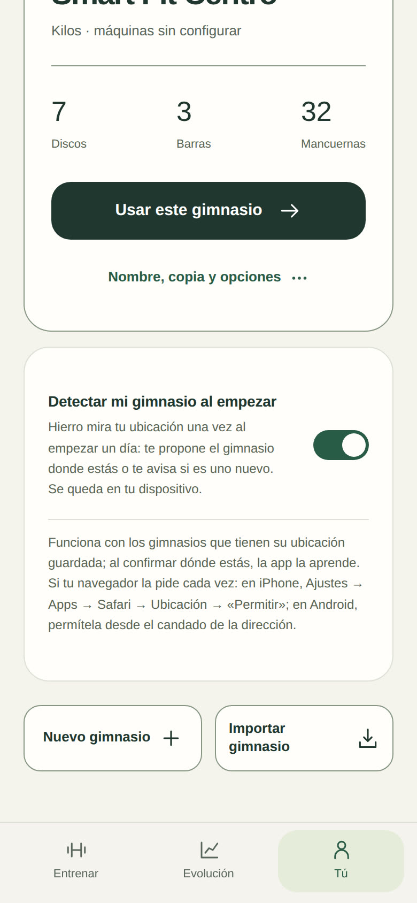

# Hierro Beta 3.18.0 · tu gimnasio por ubicación

## Qué cambia

- **Se pregunta una sola vez.** La primera vez que empiezas un día con algún gimnasio que tenga su ubicación guardada, Hierro pregunta «¿Detectamos dónde entrenas?». Tu respuesta se guarda en tus datos y la app no vuelve a preguntar. Si el navegador ya había concedido el permiso, ni siquiera pregunta: detecta directo. Se cambia en Tú → Mis gimnasios → «Detectar mi gimnasio al empezar».
- **Te dice cuando estás en un gimnasio nuevo.** Si la lectura es fiable y no cae a menos de 600 m de ninguno de tus gimnasios, aparece «No estás en ninguno de tus gimnasios», con el más cercano y su distancia. Puedes:
  - **Agregar este gimnasio**: se crea (como copia del activo o desde cero) con la ubicación donde estás, queda activo y la sesión empieza.
  - **Estoy en «…»**: si la ubicación guardada faltaba o quedó mal, elige el tuyo; cambia a ese gimnasio y aprende dónde está (una lectura imprecisa solo se guarda si no había ninguna).
  - **Empezar sin guardar nada**.
- Lo de antes sigue igual: cerca de otro de tus gimnasios propone cambiar, sin ubicación decide el historial, y el botón para empezar ya está siempre a mano.

## El permiso del navegador

La app solo pregunta una vez y nunca pide el permiso por su cuenta. Que el navegador vuelva a mostrar su propio aviso depende de él:

- **iPhone**: Ajustes → Apps → Safari → Ubicación → «Permitir» (o «Preguntar» si prefieres decidir cada vez).
- **Android (Chrome)**: una vez permitido desde el candado de la dirección, se conserva.

Si el permiso está denegado, la app no insiste: usa el historial para proponer el gimnasio.

## Calentamiento: corregir el equipo ya no lo reinicia

En un gimnasio nuevo es normal ajustar la máquina a mitad de la preparación. Antes, eso se tomaba como «otro equipo» y la preparación empezaba de cero, aunque los pesos fueran los mismos. Ahora lo ya calentado se conserva mientras sea el mismo ejercicio y el mismo tipo; solo se recalculan los escalones pendientes con el equipo corregido. Consulta [los criterios del calentamiento](../warmups.md).

## Verificación

`node tests/run.js` cubre la pregunta única, la detección directa después, la decisión «no estás en ninguno» (y que una lectura imprecisa no la afirme), «Estoy en…» que cambia y aprende la ubicación, crear el gimnasio nuevo con su ubicación y empezar, la detección apagada, y que corregir la máquina o el gimnasio conserva el calentamiento hecho.
