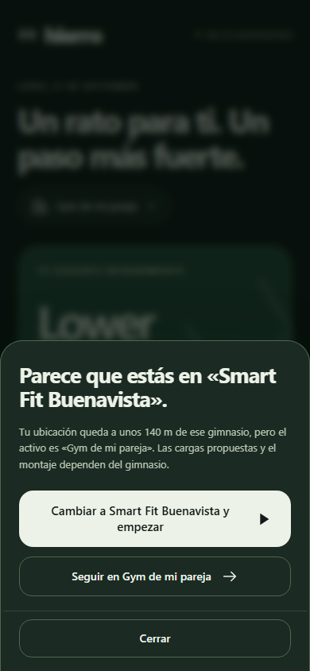
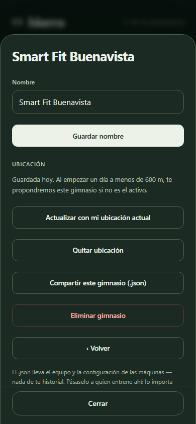

# ¿En qué gimnasio estás? · 3.11.0

El gimnasio activo decide las cargas propuestas y el montaje de discos, placas y mancuernas. Olvidar cambiarlo al volver de entrenar en otro sitio producía propuestas equivocadas sin ningún aviso.

## Decisiones

- **La ubicación detecta; la persona decide.** La app nunca cambia de gimnasio sola: una lectura mala de GPS daría pesos equivocados sin que se note. Siempre pregunta, con un toque para cambiar y otro para seguir.
- **Ubicación opcional por gimnasio.** En «Nombre, copia y opciones» de cada gimnasio se guarda la ubicación actual, se actualiza o se quita. Se redondea a cinco decimales y vive con el resto de los datos de Hierro; con la sincronización activada viaja cifrada como todo lo demás. No se envía a ningún otro servicio.
- **Radio de 600 m.** Pensado para plazas y centros comerciales: detecta desde la entrada. Si dos gimnasios guardados quedan dentro del radio, gana el más cercano. Una lectura con más de 1,5 km de margen no decide nada.
- **Sin esperas.** Al tocar «Empezar», si hay ubicaciones guardadas se pide una lectura con un límite de 4 segundos y un botón para empezar ya en el gimnasio activo. Si estás en el gimnasio activo, o no hay ninguno cerca y el historial no dice otra cosa, la sesión empieza sin preguntar. Si la persona cierra la comprobación, una lectura tardía no abre ni empieza nada.
- **Respaldo por historial.** Sin ubicación, sin permiso o sin lectura, se mira dónde se hicieron las últimas cinco sesiones con gimnasio conocido. Con mayoría clara de otro gimnasio, se pregunta. Cubre el caso de volver al gimnasio habitual; el inverso, olvidar cambiar al llegar al otro, solo lo resuelve la ubicación.
- **Las sesiones guardan su gimnasio.** El cierre añade `gymId`. Las sesiones anteriores lo recuperan del contexto de carga de sus series cuando existe.
- Con un solo gimnasio, con una sesión en curso o con una sesión abierta en otro dispositivo, no hay comprobación.

## Límites conocidos en iPhone

Una app web solo puede leer la ubicación con la app abierta, nunca en segundo plano. iOS puede volver a pedir el permiso cada cierto tiempo en apps instaladas desde Safari; se fija en Ajustes → Privacidad y seguridad → Localización → Sitios web de Safari. Bajo techo la precisión es de 20 a 100 m, suficiente para el radio elegido.

## Verificación

La suite «3.11.0» de `tests/run.js` cubre la distancia, la limpieza de ubicaciones ilegibles, el radio y el desempate, las lecturas imprecisas, las tres decisiones posibles, el respaldo por historial, el guardado del gimnasio en el cierre, el recorrido completo de preguntar, cambiar y empezar, las respuestas repetidas o tardías, y la ficha del gimnasio. La lectura real del teléfono no se puede simular en estas pruebas: requiere comprobarse en el dispositivo.

