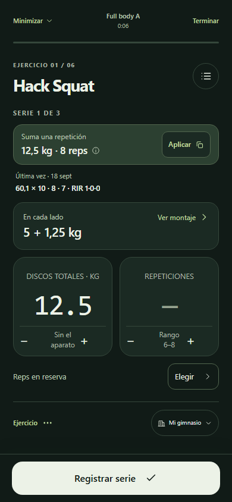
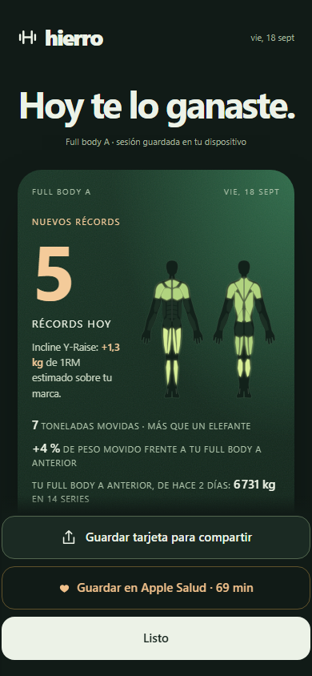
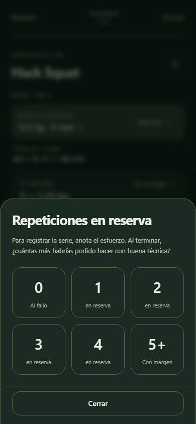

# Hierro Beta 3.9.0 · discos sin mínimo, calentamiento estable y la última carga

Cuatro problemas reportados desde el gimnasio, en una sola sesión de entrenamiento real.

## Lo que pasaba

1. **No se podía dejar de tener un disco.** El contador de pares no bajaba de uno, y quitar un disco solo estaba disponible para los añadidos a mano. La opción de marcarlo como no disponible existía, tocando el disco, pero no era evidente.
2. **El calentamiento se reiniciaba varias veces.** Cambiar el inventario de discos, y luego subir un poco la carga prevista, descartaban una preparación ya hecha. Cada cambio devolvía el recorrido al primer escalón.
3. **No había referencia de la última carga.** Al no poder con la propuesta, no se veía cuánto se había cargado la vez anterior para elegir ese peso o un punto medio.
4. **El cierre no decía cuánto más se había movido** respecto a la sesión anterior, solo en kilos y solo cuando no había marcas.

## Decisiones

- **Discos.** Bajar de un par con «menos» saca el disco del gimnasio, igual que tocarlo; «Quitar peso» aparece en todos los discos. «Restaurar juego estándar» sigue devolviendo la lista inicial.
- **Calentamiento.** Subir la carga prevista hasta un 15 % conserva la preparación: terminada sigue terminada y, a medias, mantiene los escalones hechos y recalcula los pendientes para la nueva carga. Por encima de ese margen se vuelve a preparar. Cambiar discos o mancuernas ya no descarta escalones hechos: solo vuelve a montar los pendientes con lo que hay. Cambiar de gimnasio, de máquina o de salto principal sigue reiniciando, como antes.
- **La última vez.** Bajo la propuesta de cada serie aparece la fecha y las series de la última sesión de ese ejercicio en el mismo plan, con el formato del recibo, y un acceso «Usar» que pone esa carga en el campo. El botón habla en la convención del campo: discos totales cuando el aparato pesa, carga total si no. Usar la carga anterior no reinicia el calentamiento, porque es igual o menor.
- **Cierre.** El póster añade el porcentaje de peso movido frente a la última sesión completa del mismo plan, tanto cuando hay marcas como cuando el titular es el peso movido.

## Verificación

- Trece comprobaciones nuevas en `tests/run.js`: contador de pares hasta sacar el disco y volver, «Quitar peso» en todos, referencia visible con su acceso directo, inventario que no reinicia una preparación terminada, subida del 8 % que tampoco, «Usar» que conserva la preparación, subida del 25 % que sí prepara de nuevo, preparación a medias que conserva el escalón hecho al cambiar discos, y el porcentaje en el cierre en sus dos variantes. La prueba anterior de subida de carga se conserva con el nuevo umbral.
- Capturas con datos ficticios en un origen local, sin tocar los datos de la cuenta.

## 3.10.0 · ajustes tras probarlo en el gimnasio

- **La referencia va sin botón.** «Última vez» muestra fecha y series; la carga se escribe a mano, con la propuesta o con «Repetir anterior». Se retiró «Usar».
- **El esfuerzo es parte del registro.** Registrar una serie sin RIR abre el selector y, al elegir, confirma la serie en el mismo gesto. Desaparece «Dejar sin anotar»; el campo se presenta como necesario. Los ejercicios por tiempo siguen sin RIR. Las pruebas de recorrido anotan el esfuerzo en sus series, como haría la persona.
- **El cierre siempre muestra la sesión anterior.** Junto a las cifras del día aparece «Tu Lower anterior, de hace 5 días: 4 380 kg en 9 series». El porcentaje solo se calcula cuando las dos sesiones son completas; si la anterior es parcial se indica.

