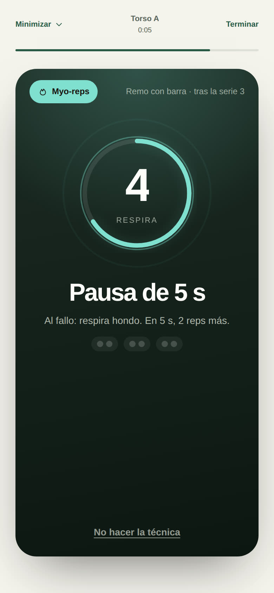
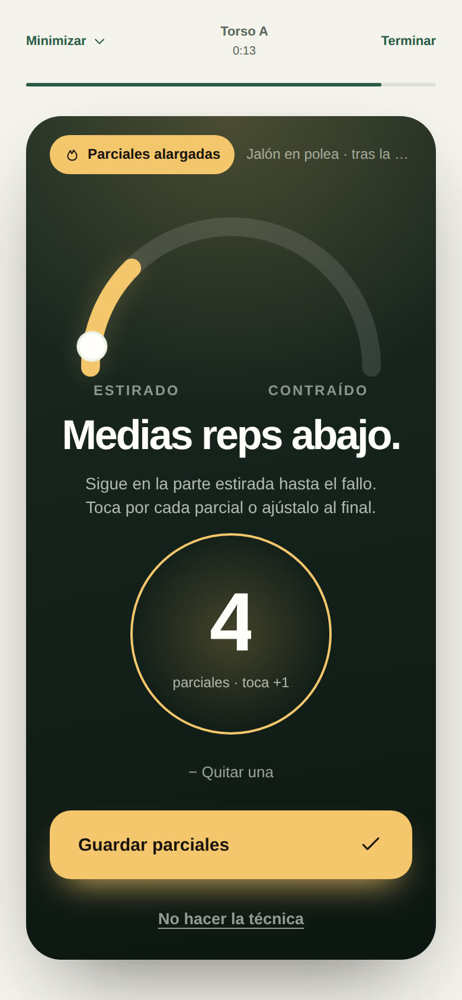
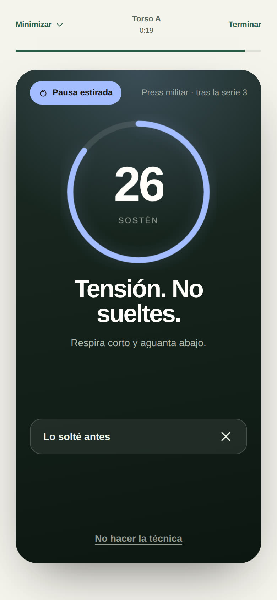

# Hierro Beta 3.16.0 · técnica en la última serie

Muchos programas, como el de Jeff Nippard, añaden en un segundo bloque una técnica de intensidad que se hace solo después de la última serie de trabajo de un ejercicio. Hierro ahora deja configurarla, la recuerda en el momento justo y anota lo que salió, sin mezclarlo con la serie.

## Las cuatro técnicas

| Técnica | Qué se hace | Qué se anota |
|---|---|---|
| Drop set | Al fallo, bajar ~25 % del peso y otra vez al fallo. Repetir una vez más: tres series seguidas, sin descanso. | El peso y las reps de cada caída. |
| Parciales alargadas | Al fallo con recorrido completo, seguir con medias repeticiones en la parte estirada hasta el fallo. | Cuántas parciales. |
| Myo-reps | Al fallo, 5 s de pausa y 2 reps más; repetir hasta que no salgan las 2. | Las reps extra y cuántas mini-series de 2 salieron. |
| Pausa estirada | Al fallo, sostener la posición estirada, con tensión, 30 s. | Los segundos. |

## Dónde se configura

- **En el ejercicio**: Equipo y objetivos → «Técnica en la última serie». En «Reglas generales» vale para todos los planes; en «Solo este plan» se puede heredar, elegir otra o poner «Ninguna en este plan» (para el bloque 1, por ejemplo).
- **En plena sesión**: opciones del ejercicio → «Técnica en la última serie». Se guarda en el plan de esa sesión.
- El plan compartible la incluye, y al importarlo solo se aceptan técnicas conocidas.

## Cómo se usa al entrenar

1. Durante el descanso anterior, la tarjeta «Siguiente» avisa: «Al terminarla: drop set».
2. En la última serie, una tarjeta recuerda la técnica y cómo hacerla.
3. Al registrar esa serie (con su RIR), la sesión pasa a **la pantalla de la técnica**: oscura, a pantalla completa y con un color y una escena propios. **El descanso no corre mientras tanto**: empieza al terminar la técnica, porque es parte de la serie.
4. **«No hacer la técnica»** está siempre abajo: vuelve al descanso sin anotar nada. En el drop set, tras la primera caída, se convierte en «Terminar sin la segunda caída» y conserva la caída hecha.

| Técnica | La pantalla |
|---|---|
| Drop set (coral) | Una escalera de tres barras que baja: tu serie, caída 1 y caída 2. El peso de cada caída rueda hacia abajo con un sonido de discos al quitarse, ya ajustado a tu equipo y con lo que va por lado; se puede afinar con − y +, nunca por encima de lo anterior. Anotas las reps de cada caída. |
| Myo-reps (aguamarina) | La pausa de 5 s empieza sola, con un reloj que respira y un tic por segundo. Al terminar, un «2» enorme pide las reps; «Las 2» vuelve a la pausa, «Solo 1» o «Ninguna» terminan. Unas fichas cuentan las mini-series. |
| Parciales alargadas (ámbar) | El arco del recorrido con su parte estirada iluminada y un punto que va y viene ahí. Un círculo grande suma una parcial por toque. |
| Pausa estirada (azul) | Una barra en tensión espera a que estés en posición; «Empezar los 30 s» abre un reloj que late y avisa en los últimos 3. «Lo solté antes» anota los segundos aguantados. |

Al terminar, el descanso arranca con «Serie guardada · Drop 45 × 8 → 35 × 8», una campana y un poco de confeti. Todo se guarda en la sesión: si cierras la app a mitad de la técnica, vuelve donde ibas. En una descarga no se propone.

## Lo que no cambia

- **La progresión**: el peso, las reps y el RIR de la serie quedan tal cual, y la doble progresión los juzga igual que siempre. La técnica se guarda aparte, dentro de esa serie.
- **Las series**: no cuentan como series nuevas ni para el mapa muscular.

Sí suman al **peso movido** las caídas del drop set y las reps de los myo-reps, porque son trabajo con recorrido completo; las parciales y la pausa no. El diario muestra la técnica tras las series («60 × 8 · 8 · 7 · RIR 2·1·0 · Drop 45 × 7 → 35 × 5»), editar la sesión la conserva y, en el cierre, «Antes → ahora» marca el ejercicio con «+ Drop set».

## Verificación

`node tests/run.js` incluye la suite «3.16.0 — técnica de intensidad en la última serie»: configuración general y por plan, limpieza de lo anotado, peso de cada caída, que el descanso espera a la técnica, el flujo de las cuatro pantallas, cancelar en cualquier momento (conservando una caída ya hecha), que la progresión juzga lo mismo con o sin técnica, descarga sin técnica, exportar e importar el plan y editar la sesión.
