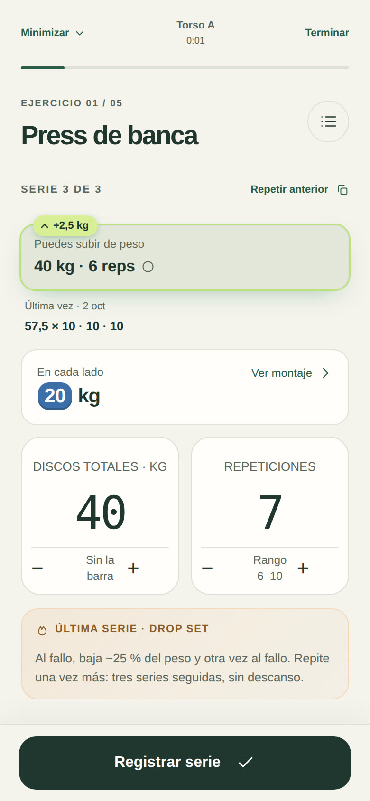
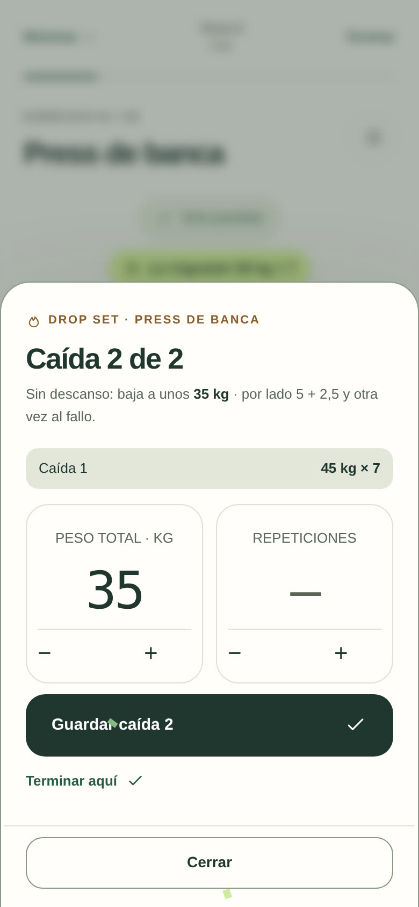
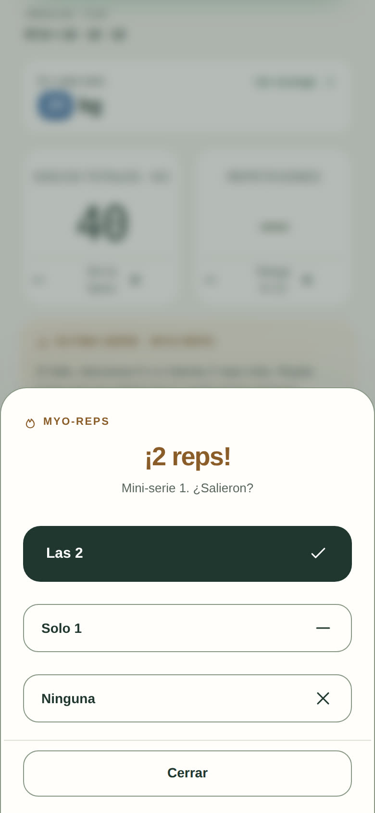

# Hierro Beta 3.16.0 · técnica en la última serie

Muchos programas, como el de Jeff Nippard, añaden en un segundo bloque una técnica de intensidad que se hace solo después de la última serie de trabajo de un ejercicio. Hierro ahora deja configurarla, la recuerda en el momento justo y anota lo que salió, sin mezclarlo con la serie.

## Las cuatro técnicas

| Técnica | Qué se hace | Qué se anota |
|---|---|---|
| Drop set | Al fallo, bajar ~25 % del peso y otra vez al fallo. Repetir una vez más: tres series seguidas, sin descanso. | El peso y las reps de cada caída. |
| Parciales alargadas | Al fallo con recorrido completo, seguir con medias repeticiones en la parte estirada hasta el fallo. | Cuántas parciales. |
| Myo-reps | Al fallo, 5 s de pausa y 2 reps más; repetir hasta que no salgan las 2. | Las reps extra y cuántas mini-series de 2 salieron. |
| Pausa estirada | Al fallo, sostener la posición estirada, con tensión, 30 s. | Los segundos. |

## Dónde se configura

- **En el ejercicio**: Equipo y objetivos → «Técnica en la última serie». En «Reglas generales» vale para todos los planes; en «Solo este plan» se puede heredar, elegir otra o poner «Ninguna en este plan» (para el bloque 1, por ejemplo).
- **En plena sesión**: opciones del ejercicio → «Técnica en la última serie». Se guarda en el plan de esa sesión.
- El plan compartible la incluye, y al importarlo solo se aceptan técnicas conocidas.

## Cómo se usa al entrenar

1. Durante el descanso anterior, la tarjeta «Siguiente» avisa: «Al terminarla: drop set».
2. En la última serie aparece una tarjeta con la técnica y cómo hacerla. Para myo-reps y la pausa hay una guía con reloj: cuenta las pausas de 5 s y avisa cada mini-serie de 2 reps (con «Las 2», «Solo 1» o «Ninguna»), o cuenta los 30 s con aviso en los últimos 3. Lo que salió queda como borrador.
3. Al registrar la serie se abre una hoja para anotar la técnica. El drop set propone el peso de cada caída ya ajustado a tus discos, con lo que va por lado; myo-reps y pausa vienen rellenos si usaste la guía. «No la hice» cierra sin anotar nada.
4. El descanso empieza al terminar la técnica, porque es parte de la serie.

En una descarga no se propone la técnica.

## Lo que no cambia

- **La progresión**: el peso, las reps y el RIR de la serie quedan tal cual, y la doble progresión los juzga igual que siempre. La técnica se guarda aparte, dentro de esa serie.
- **Las series**: no cuentan como series nuevas ni para el mapa muscular.

Sí suman al **peso movido** las caídas del drop set y las reps de los myo-reps, porque son trabajo con recorrido completo; las parciales y la pausa no. El diario muestra la técnica tras las series («60 × 8 · 8 · 7 · RIR 2·1·0 · Drop 45 × 7 → 35 × 5»), editar la sesión la conserva y, en el cierre, «Antes → ahora» marca el ejercicio con «+ Drop set».

## Verificación

`node tests/run.js` incluye la suite «3.16.0 — técnica de intensidad en la última serie»: configuración general y por plan, limpieza de lo anotado, peso de cada caída, el flujo completo del drop set y de los myo-reps con su guía, que la progresión juzga lo mismo con o sin técnica, descarga sin técnica, exportar e importar el plan y editar la sesión.
