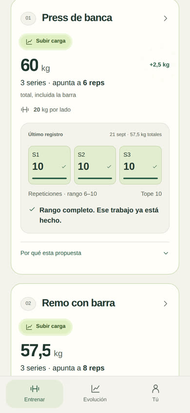
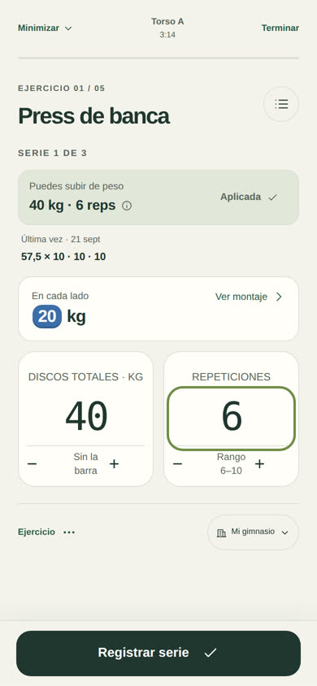
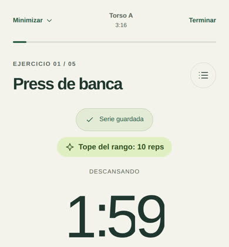
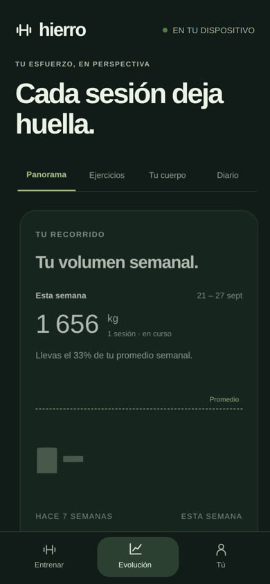
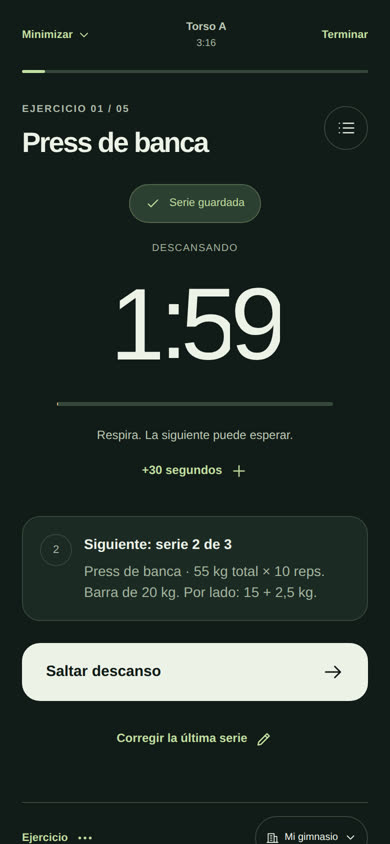
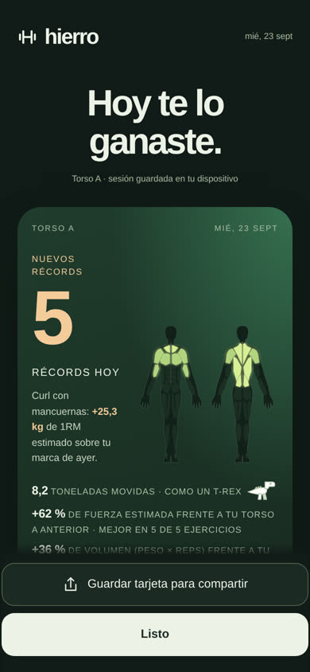

# Hierro Beta 3.13.0 · movimiento y sonido

La interfaz no cambia de diseño: mismas pantallas, mismos textos, mismos botones. Esta versión añade una capa de animaciones y sonidos encima de lo que ya existe, para que registrar, descansar y terminar una sesión se sienta vivo.

## Qué se mueve

1. **Cada vista entra.** Al abrir Entrenar, Evolución o Tú, las tarjetas suben escalonadas con un muelle suave. Al cambiar de pestaña entran desde el lado de la pestaña elegida, y la píldora de la barra inferior viaja de una pestaña a otra.
2. **Los números cuentan.** Las sesiones de la semana, el volumen semanal, las sesiones y series totales y cada 1RM estimado cuentan hasta su valor. Al terminar queda exactamente el texto original.
3. **Evolución se dibuja.** Las barras del volumen crecen desde la base y las curvas de tus referencias de fuerza se trazan de izquierda a derecha. Los días entrenados de la semana aparecen con un rebote.
4. **El botón de tu siguiente entrenamiento brilla.** Un destello recorre «Empezar» cada pocos segundos y la barra de fondo de la tarjeta flota despacio.
5. **Los relojes ruedan.** El descanso entre series y el descanso del calentamiento cambian dígito a dígito. La barra y el anillo avanzan de forma continua.
6. **El montaje responde.** Al cambiar el peso con + o −, el número salta y los discos por lado se actualizan con un pequeño movimiento.
7. **El póster celebra.** Con récords, el contador sube hasta su número y, al llegar, hay un destello, confeti y una fanfarria. Las filas de récords entran una a una y los músculos del día se iluminan. La comparación del peso movido lleva su dibujo: nevera, moto, caballo, coche, camioneta, elefante, T-Rex, autobús, camión, avión o ballena.

## Qué suena

Todos los sonidos se sintetizan con Web Audio: no hay archivos, así que pesan cero y funcionan sin conexión.

| Momento | Sonido |
|---|---|
| Registrar una serie | «Clac» de disco y dos campanas |
| + o − en peso y repeticiones | Un tic, más agudo al subir |
| El montaje cambia de discos | Choque metálico |
| Últimos tres segundos del descanso | Campana suave |
| Descanso terminado | Acorde de tres notas |
| Completar un calentamiento | Kalimba, más tranquila que las series |
| Últimos segundos del descanso de calentamiento | Madera |
| Descanso de calentamiento terminado | Cuenco |
| Pasar a las series de trabajo | El cuenco sube hasta un golpe con acordes |
| Empezar una sesión | Subida corta y acorde |
| Póster con récords | Subida, golpe grave con platillo y fanfarria con destellos |
| Póster sin récords | Acorde suave de cierre |
| La comparación del póster | El sonido del objeto: barrito, rugido, claxon, despegue… |
| Guardar la tarjeta | Obturador |
| Pestañas, interruptores, propuesta aplicada | Toques breves |

## Lo que se respeta

- **Sonido**, **Vibración** y **Animaciones** de Preferencias siguen mandando. Con el sonido apagado no suena nada; con las animaciones apagadas o con «Reducir movimiento» del sistema, todo aparece sin movimiento.
- Los avisos del temporizador siguen siendo los mismos y a los mismos segundos; solo cambia el timbre. En un navegador sin Web Audio completo se usa el pitido anterior.
- iPhone no permite vibrar a las páginas web; allí quedan el sonido y la animación. Con el interruptor de silencio activado, iOS calla el sonido.
- Nada de esta capa guarda datos ni cambia cálculos. Las equivalencias del póster suman dos escalones: un T-Rex (8 t) y un avión de pasajeros (70 t).

## 3.14.0 · lo que viene se celebra

La app se usa en ráfagas: desbloquear, anotar peso y repeticiones, bloquear. Y el momento que más se espera es abrir un día y ver si toca subir. Esta versión pone el movimiento ahí.

1. **Cada propuesta se revela al verla.** Al abrir un día, cada tarjeta se anima cuando entra en pantalla: las barras de tus series se llenan, los checks de las que tocaron el tope aparecen uno a uno y, si la propuesta es **Subir carga**, el peso rueda del anterior al nuevo (57,5 → 60), el «+2,5 kg» sale con destellos y suena una escala que sube. Si toca ajustar hacia abajo, el número baja con dos notas suaves: es información, no un regaño.
2. **Inicio anticipa.** En «Tus días», el número de ejercicios para avanzar cuenta y da un pequeño salto cada pocos segundos.
3. **El tope del rango se nota al registrar.** Si la serie que acabas de guardar llega al tope, aparece «Tope del rango: 10 reps» con su propia campana, además del «clac». Si todas las series del ejercicio llegaron, dice «Todas tus series en el tope del rango» y suena la escala de subir. No promete una subida: la decide el motor con su historial y tu equipo.

4. **Registrar se siente.** La fila «Reps en reserva» con su botón «Elegir» desaparece de la pantalla de la serie: el esfuerzo se pide una sola vez, al tocar «Registrar serie», y elegirlo guarda la serie en el mismo toque. Sus botones entran escalonados. Mantener pulsado + o − avanza solo y acelera. Los discos por lado aparecen como fichas con su color (rojo 25, azul 20, amarillo 15, verde 10, blanco 5…). Al registrar, un check sale del botón y aterriza en «Serie guardada». Terminar todas las series de un ejercicio tiene su propio cierre sonoro.

## Verificación

- `node tests/run.js` incluye una suite nueva: cada equivalencia tiene dibujo y sonido, la camioneta no se confunde con el camión, sin animaciones el reloj escribe el texto tal cual, con el sonido apagado la interfaz calla y el calentamiento conserva sus avisos.
- Las demás suites (sin conexión, actualización, sincronización, avisos y beta) pasan sin cambios.
- Las capturas son del documento beta construido, en modo oscuro a 390 px, con datos ficticios sembrados en un origen local. La primera está tomada a mitad de la entrada de Evolución: el volumen todavía está contando.

