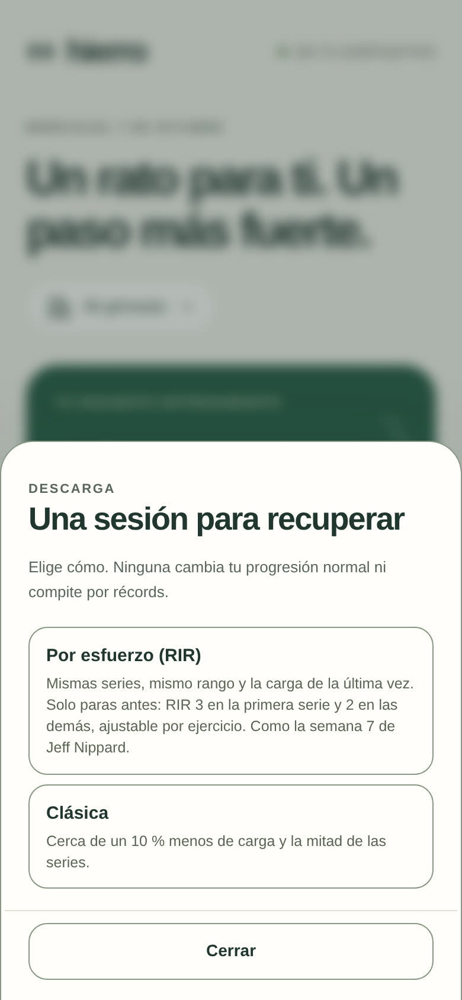
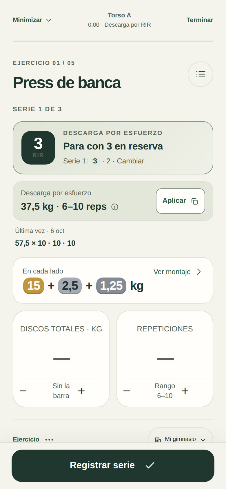
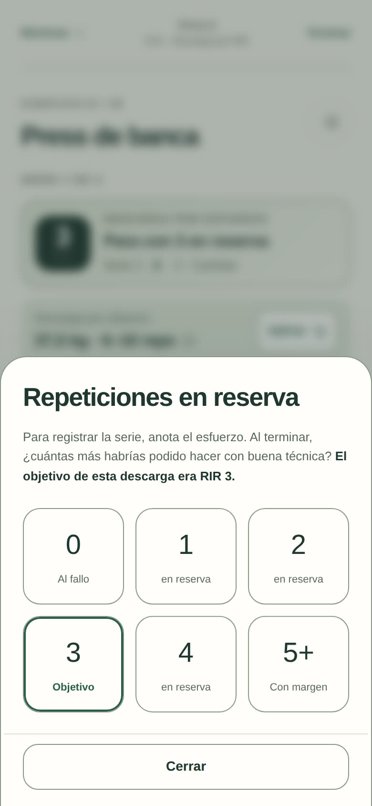
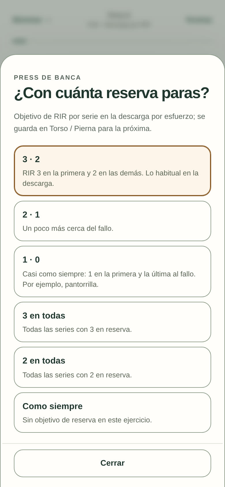

# Hierro Beta 3.17.0 · descarga por esfuerzo

La descarga de siempre baja cerca de un 10 % la carga y deja la mitad de las series. Programas como el de Jeff Nippard plantean otra cosa en su semana de descarga: **mismas series, mismo rango de repeticiones y la misma carga, pero parando antes**. Por ejemplo, RIR 3 en la primera serie y RIR 2 en la segunda, y en algunos ejercicios, como la pantorrilla, RIR 1 y luego al fallo.

## Cómo se usa

1. En el día, «Descarga» ahora pregunta el tipo:
   - **Por esfuerzo (RIR)**: mismas series, mismo rango y la carga de la última vez; solo cambia con cuánta reserva paras.
   - **Clásica**: cerca de un 10 % menos de carga y la mitad de las series, como antes.
2. En la descarga por esfuerzo, cada serie muestra su objetivo: «Para con 3 en reserva», y en la siguiente «Para con 2 en reserva». Debajo se ve la pauta completa del ejercicio, con la serie actual marcada.
3. Al registrar la serie, el selector de RIR marca el objetivo («Objetivo») y lo recuerda en el texto. Anotas lo que de verdad dejaste en reserva.
4. Tocar el objetivo permite cambiarlo para ese ejercicio: 3 · 2 (por defecto), 2 · 1, 1 · 0 (pantorrilla), 3 en todas, 2 en todas o «Como siempre». Se guarda en el plan, así que la próxima descarga ya lo trae.

## Lo que hace la app con la carga

- Las series y el rango son los de siempre.
- La carga es la de la última sesión normal. Si tocaba subir, en la descarga no se sube: se mantiene la de la última vez.
- La propuesta muestra el rango completo («60 kg · 8–10 reps»): lo que salga dentro del rango con esa reserva está bien.

## Lo que no cambia

- Una descarga por esfuerzo es una descarga: **no alimenta la progresión ni compite por récords**. La sesión normal siguiente propone exactamente lo que iba a proponer.
- No se propone la técnica de la última serie.
- El cierre la reconoce: «Recargar también es avanzar. Las mismas series, con reserva a propósito».
- El plan compartible se lleva la reserva de cada ejercicio, y al importar solo se aceptan pautas válidas.

## Verificación

`node tests/run.js` incluye la suite «3.17.0 — descarga por esfuerzo»: la clásica no cambia; la de esfuerzo conserva series, rango y la carga anterior aunque tocara subir; el objetivo por serie y por ejercicio; el RIR marcado; lo inválido no se guarda; la progresión sigue donde iba después; exportar e importar el plan.
