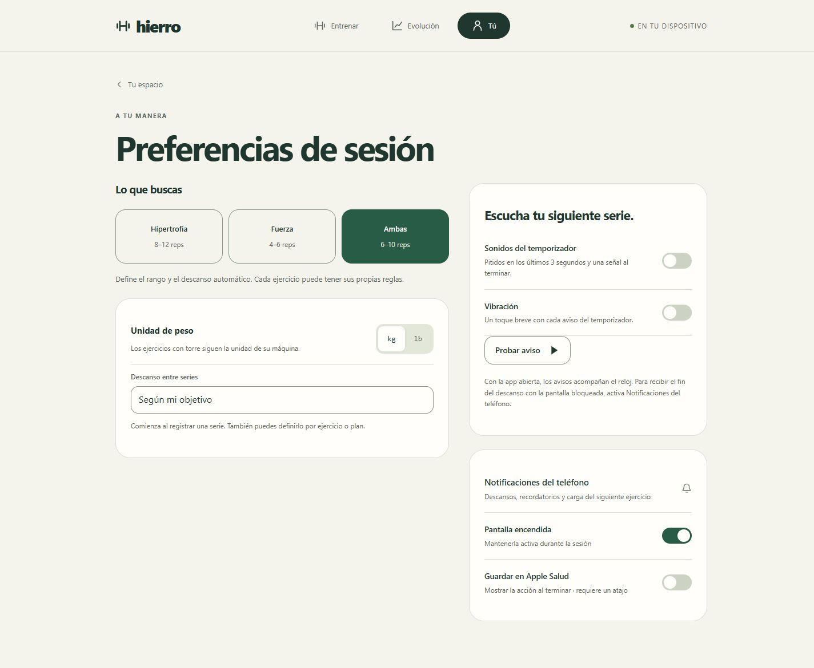
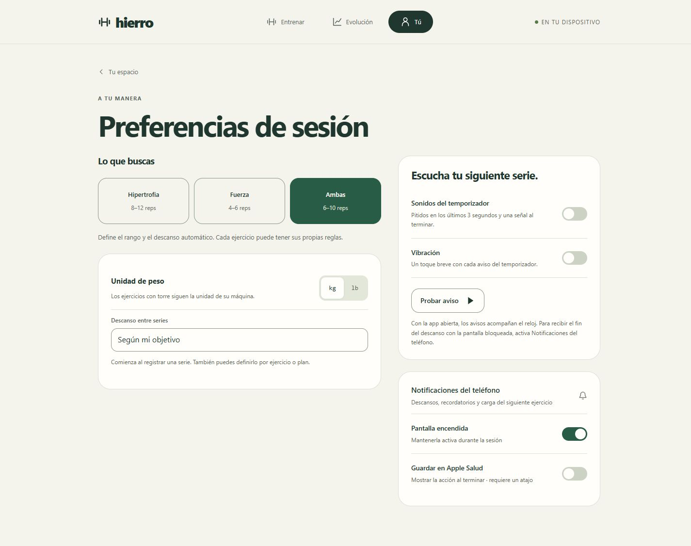
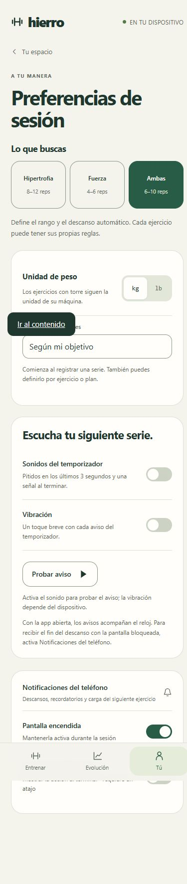
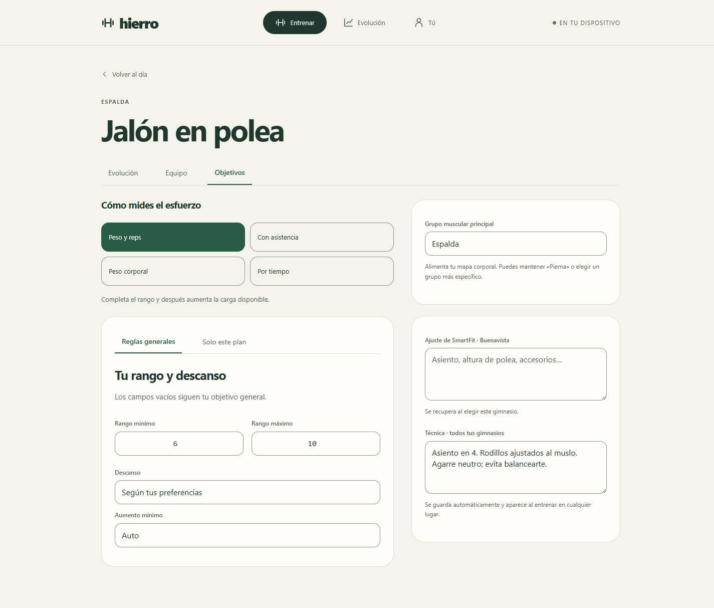
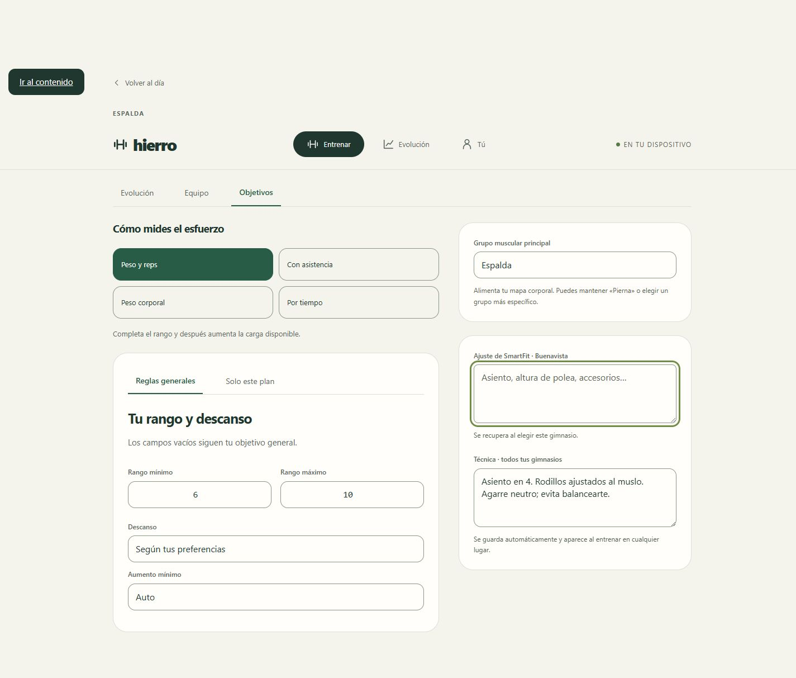
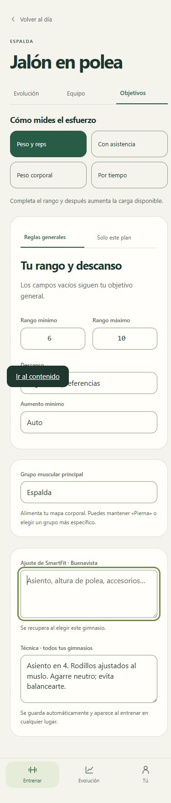

# Hierro Beta 3.6.1 · tarjetas de preferencias y objetivos

Las dos columnas laterales usan ahora el mismo contenedor de tarjetas: una sola columna de ancho limitado, tarjetas al 100 %, sin márgenes individuales y con 24 px entre ellas. Los primeros encabezados o campos comparten el margen interior de la tarjeta. El enlace a notificaciones comienza en el mismo margen interior que el título de avisos. Se mantienen colores, tipografía, bordes y animaciones.

«Probar aviso» queda 22 px debajo del separador de vibración. Su mensaje de estado ocupa espacio cuando hay un resultado, y crece dentro de la tarjeta sin superponer la siguiente.

## Comprobación

Se revisaron ambas pantallas en Chromium con viewports de 1440, 1024, 390 y 320 px. Las [mediciones del DOM](measurements.json) confirman bordes izquierdos y derechos coincidentes, 24 px entre tarjetas y ausencia de desbordamiento horizontal en todos los tamaños. El margen interior superior es idéntico en cada pareja: 27 px en escritorio, 23 px a 390 y 20 px a 320, incluyendo el borde. El aviso mantiene sus 22 px de separación al mostrar el mensaje de resultado.

En la captura inicial de Chromium a 1440 px los bordes externos ya coincidían; no se reprodujo un desplazamiento horizontal de los contornos. Sí se observó el botón pegado al separador, y los distintos márgenes interiores y estructuras se sustituyeron por reglas compartidas. No se verificó en un iPhone físico.

Pasaron las pruebas existentes del motor/interfaz (856), beta (19), arranque y actualización de beta (21) y funcionamiento offline de beta (35). La comprobación del botón se hizo con sonidos desactivados y verificó su mensaje explicativo; no se enviaron notificaciones remotas. La consola de la copia local no registró errores ni advertencias. Todas las capturas utilizan datos ficticios en un origen local independiente.

## Preferencias

Antes:

Después:

## Objetivos del ejercicio

Antes:

Después:

