# Hierro Beta 3.6.0 · refinamiento de experiencia

Esta implementación parte de la [auditoría de la versión 3.5.1](../ui-audit-2026-09-14/README.md). Conserva la paleta verde, el fondo cálido, los degradados, la tipografía, los dibujos del equipo y las transiciones. Las capturas usan datos ficticios en un origen de prueba independiente.

## Entrenar con menos interrupciones

El botón de registrar y la confirmación del calentamiento permanecen al pie de la pantalla. El contenido puede desplazarse sin perder la acción principal. Se reserva espacio para el área segura y se adapta la posición a `visualViewport` cuando aparece el teclado. Las notas siguen visibles y admiten saltos de línea.

El descanso conserva su reloj al consultar otro ejercicio. Su tarjeta anticipa la siguiente carga y el montaje, o el calentamiento si corresponde. Al continuar después de completar un ejercicio se abre el siguiente. El cronómetro de ejercicios por tiempo usa una hora de finalización persistida: se puede minimizar, recargar y retomar. Cancelar una medición pide confirmar. Eliminar una serie ofrece deshacer sin perder su peso original.

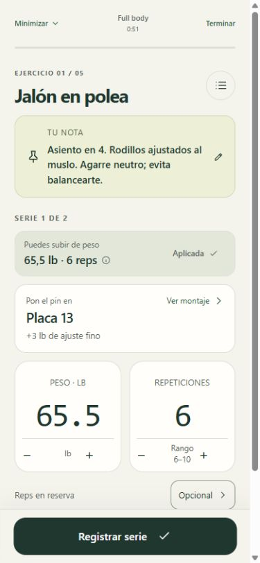
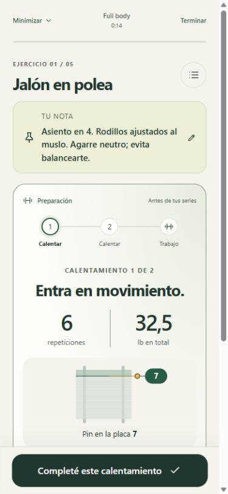
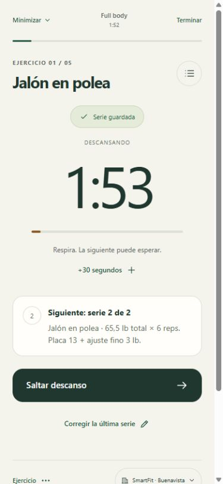

## Consultar el progreso y organizar

Los días conservan sus tarjetas de doble progresión, sus rangos por serie y su degradado. Se reduce el encabezado interior y se compacta el resumen para llegar antes a los ejercicios. En pantallas estrechas el inventario usa filas y sus cuatro pestañas pasan a dos filas antes de que sus nombres se junten.

La gráfica de cada ejercicio abre con la carga real registrada y sus repeticiones. La estimación de fuerza tiene su propio selector. Una sesión parcial se identifica expresamente y no muestra una comparación de volumen con sesiones completas. Corregir o eliminar historial recalcula las marcas guardadas; las descargas no establecen récords.

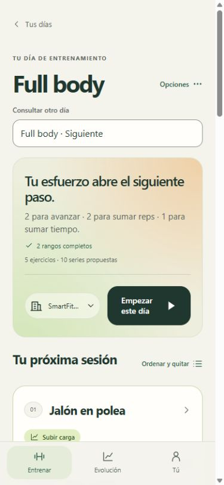
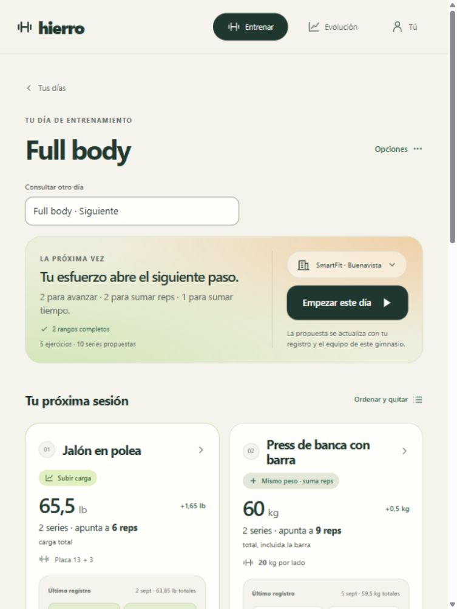
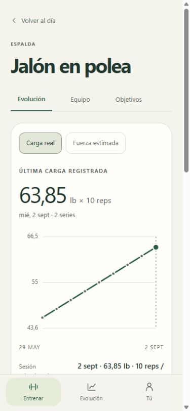
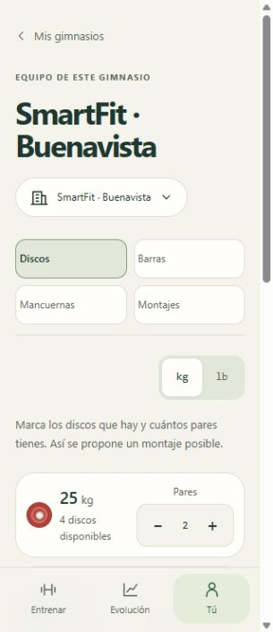

## Contexto, guardado y accesibilidad

- Registrar, terminar, corregir series, importar, duplicar variantes y eliminar planes o sesiones confirman primero la escritura local. Si falla, se conserva el estado anterior y aparece una advertencia persistente con reintento y descarga.
- Una copia ilegible no se sustituye por una base vacía. Restaurar guarda una copia local previa y recupera también el reloj del descanso.
- Las sesiones e historial conservan su plan de origen aunque se mueva o quite un día. Editar las series de otro plan no modifica las de una sesión ya iniciada.
- Las notas distinguen técnica general y ajustes de este gimnasio. Ambas aparecen juntas al entrenar; cada gimnasio recupera sus propios ajustes.
- Crear una variante de máquina afecta al día consultado y, cuando corresponde, a su sesión; no se añade a todos los planes.
- Al crear un ejercicio nuevo se eligen tipo y equipo antes de añadirlo. La biblioteca permanece abierta para preparar varios ejercicios seguidos.
- Las pestañas recuerdan sección, filtros y búsqueda. Atrás del navegador recupera la vista interna. Se conserva el foco al elegir RIR y los campos exponen unidad, convención de carga y estado seleccionado.
- Los errores de sincronización se muestran dentro del diálogo activo. Las selecciones de conflicto sobreviven a cerrarlo. Es posible iniciar una sesión local independiente cuando otra está en otro dispositivo; su historial se incorpora al terminar sin tomar control de la otra sesión.
- La ayuda sin conexión comprueba los recursos del service worker antes de anunciar que está lista. Las preferencias de notificación distinguen configuración, permiso y activación real.

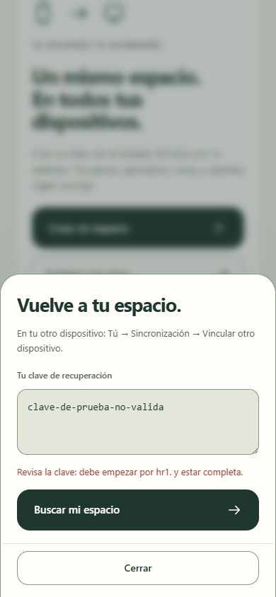
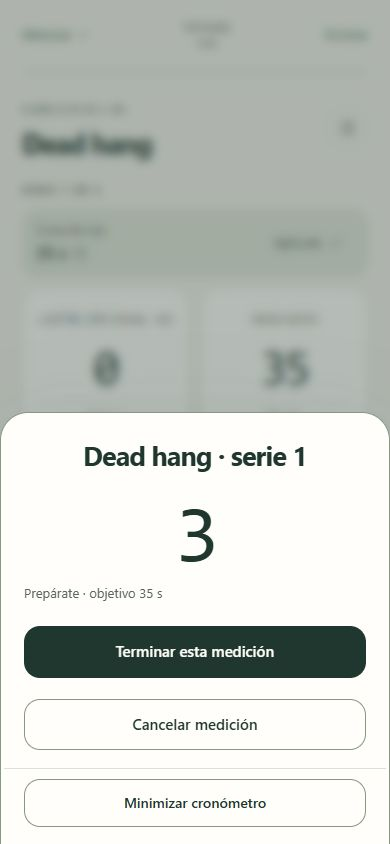
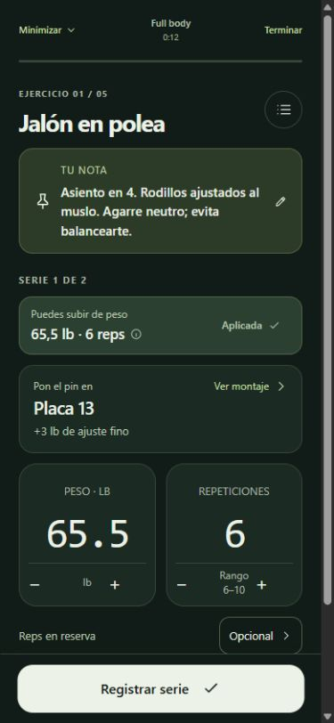
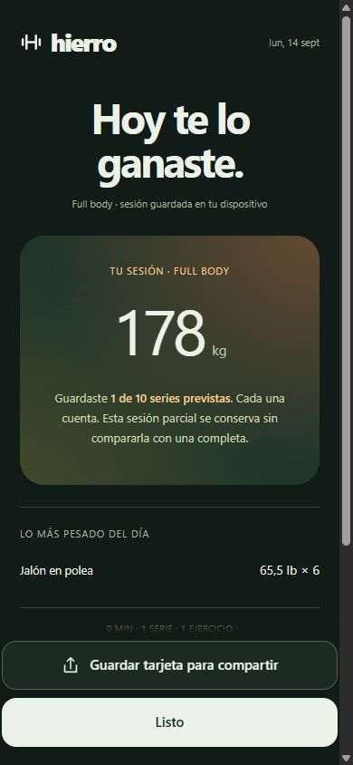

## Verificación

Se ejecutaron las ocho órdenes de verificación del proyecto: motor, offline, actualización, beta, offline de beta, actualización de beta, sincronización y push. Suman **1 131 comprobaciones**, incluidas 856 del motor y la interfaz. Las pruebas usan almacenamiento y servicios simulados o locales; no envían notificaciones reales.

La revisión visual cubrió 320 × 740, 390 × 844, 768 × 1024 y 1440 × 900, con temas claro y oscuro, nombres y notas extensos, calentamiento, descanso, cronómetro, progreso, inventario, sincronización y cierre. El botón principal midió 56 px de alto y permaneció dentro del viewport en 320 y 390 px. Se comprobó por interacción que el RIR devuelve el foco, un cronómetro se retoma después de recargar y los errores de clave no quedan detrás del diálogo.

Las mediciones de axe se realizaron sobre la copia de prueba. Se corrigieron contrastes insuficientes en etiquetas de rangos y unidades. Las mediciones tomadas durante la aparición de una pantalla se descartaron y se repitieron con opacidad 1. No equivalen a una certificación WCAG ni a seguimiento ocular.

El teclado nativo, VoiceOver y los márgenes físicos de una PWA instalada en Orion/iPhone requieren una comprobación en ese dispositivo. La auditoría anterior conserva sus hallazgos originales; los escenarios F06 y F12 no se habían reproducido de forma válida y no se presentan aquí como defectos corregidos.
