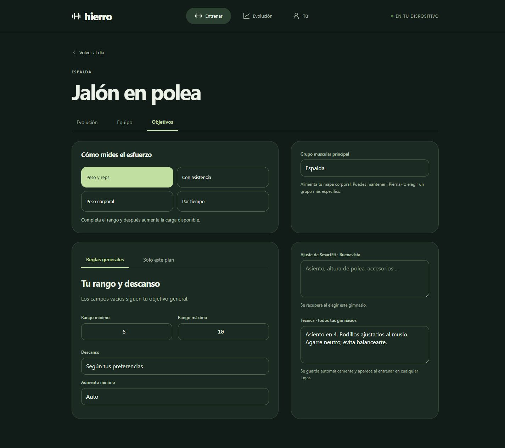
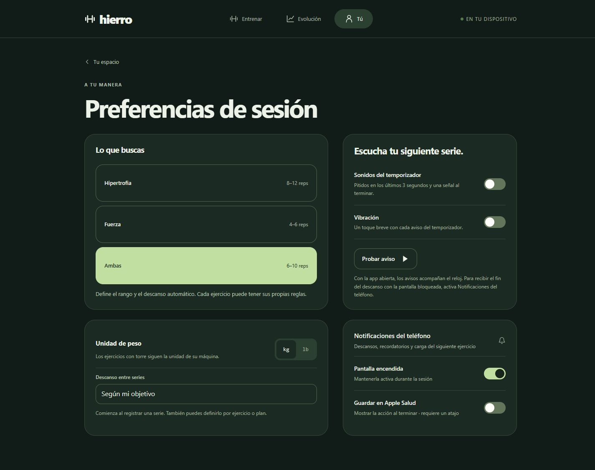
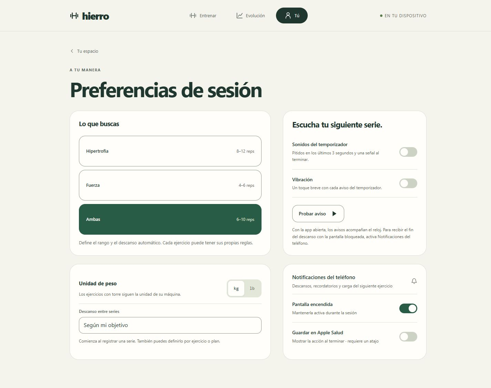
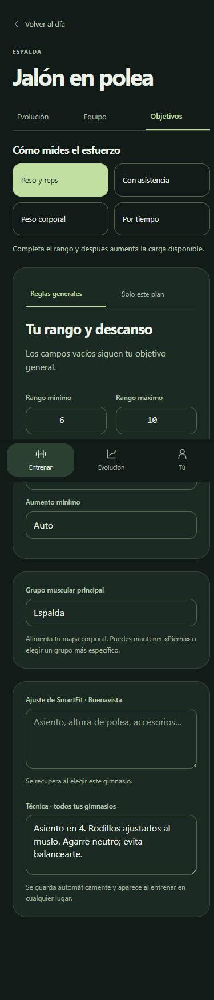
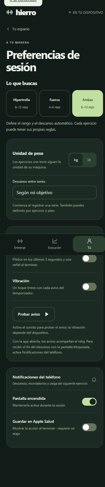

# Hierro Beta 3.6.2 · alineación entre columnas

La versión 3.6.1 igualaba los márgenes dentro de la columna derecha. El problema señalado era la altura de sus tarjetas respecto de las tarjetas de la izquierda: las dos columnas calculaban sus posiciones de forma independiente.

Preferencias de sesión y objetivos del ejercicio usan ahora cuatro tarjetas en una cuadrícula con dos filas compartidas. Cada pareja tiene el mismo borde superior e inferior, incluso cuando cambia la altura del contenido. Los selectores iniciales quedan dentro de su tarjeta en escritorio para que los límites de ambas columnas sean claros. Las tres opciones de objetivo se presentan como filas dentro de esa tarjeta, aprovechando su altura.

Hasta 700 px se conserva una columna, con los selectores iniciales abiertos como antes y el orden de controles anterior. El cambio solo afecta la presentación: se mantienen funciones, estilos de color, animaciones y el margen de 22 px de «Probar aviso».

## Verificación

Las [mediciones del DOM](measurements.json) comprueban ambas pantallas a 1440, 1024, 768, 701, 700, 390 y 320 px. En los cuatro anchos de escritorio la diferencia entre bordes superiores e inferiores de cada pareja es **0 px**. En móvil se comprueba el orden vertical y la ausencia de desbordamiento. También se comprobó que el mensaje de «Probar aviso» hace crecer la fila completa y mantiene alineada la siguiente.

Se revisaron capturas del tema oscuro y de preferencias en tema claro. Las pruebas existentes del motor/interfaz (856), beta (19), actualización de beta (21) y offline de beta (35) pasaron. La consola no registró errores ni advertencias durante las comprobaciones. Las capturas usan datos ficticios en un origen local independiente; no se modificaron los datos del usuario ni se enviaron notificaciones remotas.

## Objetivos en escritorio

## Preferencias en escritorio

## Una columna en móvil

